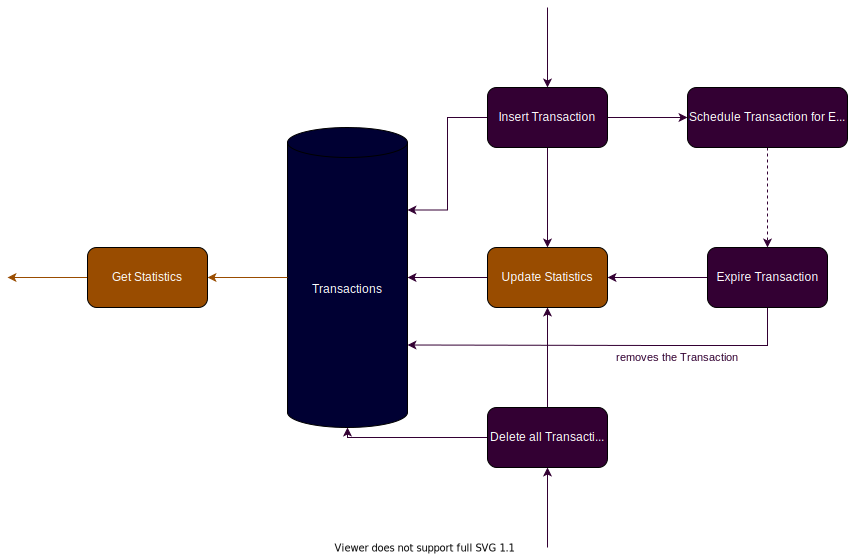

# N26 Coding Challenge

## Table of Contents
1. [Description](#-Description)
2. [Build, Test, and Run](#-Build-Test-and-Run)
3. [Design](#-Design)
4. [Requirements](#-Requirements)

## 💳 Description

The **N26 Coding Challenge** application is a Spring-Boot application that provides a RESTful API for computing real-time transaction statistics.
In this challenge, ONLY recent transactions (less than a minute old) MUST be considered. All other transactions MUST be discarded.

The application provides the following endpoints:
- `POST /transactions`: Inserts a new Transaction. Called whenever a transaction is made.
- `DELETE /transactions`: Discards all existing Transactions.
- `GET /statistics`: Returns Statistics from all recent Transactions (less than a minute old). 

## 💻 Build, Test, and Run

#### Docker (recommended)

Installation steps may differ from machine to machine. Please follow instructions accordingly:
For reference, I have built this project using:
- Docker 20.10.7 @ https://docs.docker.com/get-docker/

A `Dockerfile` has been added to the project's root directory, easing dependency management and deployment.
- Building the Docker image: `docker build . -t n26`
- Running the Docker image: `docker run n26 -p 8080`

---

A `docker-compose` file has (also) been added to the project's root directory.
This time, the intention is to allow other developers to code within a containerized environment.
This is a quickest way to develop, at the expense of not having a really good integration with IDEs and text editors...
- Developing from within a "*N26 container*": `docker-compose run --service-ports dev /bin/bash`
  - Once inside the container, all _Maven_ commands apply (e.g. `mvn test`)

#### Locally

Installation steps may differ from machine to machine. Please follow instructions accordingly:
For reference, I have built this project using:
- Java 1.8 ([OpenJDK8](https://openjdk.java.net/install/)) @ https://www.java.com/download/
- Maven 3.8.1 @ https://maven.apache.org/
- Linux - Manjaro 21.0.7 (64bit)

**Commands:**
- Building the project (with locally installed dependencies): `mvn clean install`
- Testing the project (with locally installed dependencies): `mvn test`
- Running the project (with locally installed dependencies): `mvn spring-boot:run`

##### Additional notes
The **N26 Coding Challenge** application uses Spring's `TaskExecutor` and Java's `ScheduledExecutorService` classes so as to provide support for asynchronous methods and scheduled tasks, respectively.

Both can be configured using environment variables - or directly, in the `application.yaml` file.
Environment variables supported are:
- `EXECUTORS_TASK_CORE_POOL_SIZE`: The ThreadPoolExecutor's core pool size. Default is 1.
- `EXECUTORS_SCHEDULER_CORE_POOL_SIZE`: The ScheduledExecutorService's core pool size. Default is 1.

## 📝 Design

This project follows a standard clean architecture approach, with hints of Domain-Driven design, and CQRS concepts.

> This diagram only acts as a simple sketch and may not be a 1:1 representation of the current architecture.

Two domain entities are clearly identifiable:
- `Transaction`, containing the `Amount` value object (since we need custom business policies for scaling and rounding of numbers), and a timestamp, identifying when the Transaction has been created (in the real world, not in the application).
- `Statistics` containing the well-defined set of transaction statistics (`sum`, `average`, `maximum`, `minimum`, `count`). 

A few events have been identified and implemented as use cases. All use cases implement either `Command` or `Query` interfaces, so as to make methods' intentions (modification/querying) a bit more explicit.

The following use cases have been identified:
- `Insert Transaction`: creates and inserts a new Transaction into the Transaction storage
  - side-effects: 
    - schedules the new transaction for expiration
    - updates statistics
- `Remove All Transaction`: removes all transactions from the Transaction storage
  - side-effects:
    - updates statistics
- `Get Statistics`: queries the Transaction storage for most recent (less than a minute old) statistics
  - > I've decided to filter all transactions before returning the relevant ones. This makes the time complexity O(N). However, we can simply **not** do that (filter). Tests will pass and time complexity will go down to O(1). However, this will make the "60-second" constraint **very** implicit. I have decided in favor of explicitness.
- `Schedule Transaction For Expiration`: schedules a Transaction to be expired as soon as it reaches its "relevancy deadline" (in this case, 60 seconds after its creation timestamp)
- `Expire Transaction`: removes a transaction from the Transaction storage
  - side-effects:
    - updates statistics

> Spring's `ApplicationEvent`s would allow for inversion of control and a cleaner implementation. I've decided **not** to use events yet, so as to keep this layer as decoupled as possible from the framework. I believe the decision to use events should be taken at a later point in time.

Use of Spring, Lombok, or any other framework or library is **strongly** discouraged within `domain` and `usecases` boundaries/directories. Framework-specifics and libraries do appear at infrastructure level, though. 

At Infrastructure level, three adapters are implemented:
- `TransactionController`: handles web requests (and exceptions) for all `/transactions` endpoints
- `StatisticsController`: handles web requests (and exceptions) for all `/statistics` endpoints 
- `InMemoryTransactionRepository`: stores (in-memory) all Transactions 

Storage of Transactions has been implemented using a `ConcurrentHashMap` so as to allow O(1) time complexity for insertions (soft requirement). Lookups and deletions also have O(1) time complexity, allowing for an expiration mechanism to discard any unecessary Transactions as soon as they get over the 60 second mark (project requirement). Therefore, the storage's space complexity can be estimated to be linear to all relevant transactions at a given point in time - i.e. O(N).

Finally, Statistics are stored as a single value object and are not impacted by concurrent writes/reads due to its immutability properties.

## 📜 Requirements
- [x] Application runs in Maven
  - [x] `mvn clean install` and `mvn clean integration-test` complete succesfully
    - > This project uses the same `pom.xml` present in the "skeleton" provided by N26. Nothing has been changed
- [x] API is thread-safe (i.e. supports concurrent requests)
  - > `TransactionRepository` stores Transaction objects in a `ConcurrentHashMap`, Statistics are immutable by nature (value objects)
- [x] Works without a database (including in-memory databases)
  - > See`InMemoryTransactionRepository` class
- [x] Service does **not** store all transactions in memory all the time
- [x] Irrelevant transactions are discarded
  - > See `ScheduleTransactionForExpiration` and `ExpireTransaction` use cases
- [x] Project has unit tests
  - > Lots of them!
- [x] No changes have been done to integration tests @ `src/it`
- [ ] Solution is production-ready
  - > In my opinion, no solution will be "production-ready" within the given time frame (3 days). Production-ready applications would require tighter security at the outer layers (e.g. TransactionController), better observability (e.g. logging, monitoring, tracing), and better CI - I have configured a Docker GitHub action to make sure things **do** build successfully, yet we would still require things like code quality information, coverage data, and security reports.
